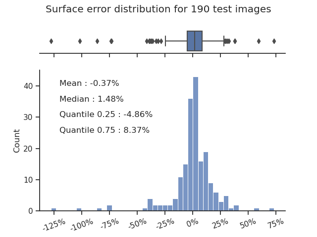

# ML_FOOLS team Project 2 "ML for science" - Detecting the Degree of Cavitation In Situ in Young Trees

This project contains the work done for the Detecting the Degree of Cavitation In Situ in Young Trees project supervised by PERL as part of CS433-Machine Learning course at EPFL.
In this project, the air bubbles created in drought inside of young living trees were estimated and compared to the overall area of vessels existing in the tree. To do that the lab used X-ray microtomography on the same section of a living tree and later on the same section of the tree after cutting and flushing all the vessels.
Due to the differences between the shapes, amounts, locations, and the quality of the scans of the vessel between different trees, this is a tedious and not obvious manual task to do.

Therefore, the goal of the project from a machine learning side was to create a model that can label to a high accuracy the air bubbles on a slice image of a tree.
To do so the team developed a U-Net[[1]](#1) - a deep CNN with a contracting encoding and an expansive decoding paths that result in the likelihood for each class. 
The architecture, as seen in the image below, encodes the image by repeatingly using 2 consecutive 2D (3x3) Convolution layers followed by a ReLU activation and then a 2D (2x2) Max Pool. Then, the decoder similarly expands back the image by doing repeatedly 2 consecutive 2D (3x3) Convolution layers followed by an Upsample with factor 2 followed by a 2D (2x2) Convolution layer. The outputs of the decoders' 2D (2x2) Covoluional layers are concatenated with croped and copied data from the parallel level encoder. Finally, a 2D (1x1) Convolutional layer is used to set the output at the desired amount of labels.


## Repository structure
```
./
|---- run.py
|       > An executeable py file to run the model on data. More description below.
|
|---- helpers.py
|       > A python file that contains all the methods used for the different notebooks.
|
|---- generate_labels.ipynb
|       > A Jupyter notebook that generates the label images for the images.
|
|---- generate_model.ipynb
|       > A Jupyter notebook that generates the final model used.
|
|- other_models_code_and_files/
|       > A folder that contains notebooks used to create the other notebooks 
|       discussed in the report, and also raw image files used to train, 
|       other saved model parameters, and multiple attempts that lead to the final result.
|
|- images/
|       > A folder that contains Session 1 and 2 images we used for training and testing
|       Only images that were specifically selected as useable are there, as per the 
|       csv_files/data_overview.csv file. These are renamed so all the information
|       about each image is in the filename itself, but otherwise they are unchanged
|       from the images output by the lab scanner and on the lab EPFL drive.
|
|- labels/
|       > A folder that contains Session 1 and 2 labels that we generated with the 
|       signal processing and CSV sections of generate_labels.ipynb. These were 
|       used for training and testing.
|       NB: the labels generated from CSV files are png and 4 channel, are made
|       visible and have transparent backgrounds, to check them visually.
|       Two functions in helpers.py : png_to_mask and mask_to_png are implemented
|       to convert back and forth from arrays of 0 and 1 only, to rgba images.
|       However the labels generated from Signal Processing are only one 
|       channel, 1 where the label is embolism region, 0 where it is not.
|       Therefore, they look black, but are therefore much lighter and 
|       straightforward to load for training.
|
|- csv_files/
|       > A folder containing the CSV files used to select the images used for the labels.
|       |
|       |---- data_overview.csv
|       |       > A file with the analyzed data from all the good samples
|       |
|       |---- emb_csv_files.zip
|               > A zip file with the EMB.csv files of all plants (Session 1, 2 & 3)
|
|- models/
|       |---- model.pickle
|       |       > the final model pickle file, generated with the generate_model.ipynb notebook
|               It contains the model parameters, and optimizer parameters (useful to train 
|               starting from this model). See more details in last section. 
```

## Getting started
First ensure you have the tools and packages listed under. Then follow the steps to create the labels, model and finally final outputs.

### Requirements

The packages and versions required to make sure everything runs as intended are listed in the file requirements.txt

### Step 1: Generate label images from CSV files

To generate the labels, open the notebook named "generate_labels.ipynb". In the notebook you will need to set the directories to which you want to store the labels to, select a CSV file containing the images you want to label with the analysis like ./csv_files/data_overview.csv for example, and select a zip file that contain all the EMB.csv files that contains at least all the images you wish to label, like ./csv_files/emb_csv_files.zip.
The CSV file needs to contain the plant_name (e.g. 1-fs-08), scan_nb (e.g. living), image_nb (e.g. 750), voxel_size (e.g. 0.007005), session (e.g. session1), and its pathname.


You can then run the run the first three cells ("imports", "Select data, CSV files, and outputs locations", and "Extract data from CSV file") followed by the cell to generate the labels method you wish.

### Step 2: Generate model

To generate the model, open the notebook named "generate_model.ipynb". In the notebook you first need to set the parameter "env" to specify if the notebook is ran on Google Cloud Platform, Google Colab or lacally. The parameter should be set to "gcp", "colab" or "local" respectively. Also, the parameter "train_or_load" could be adjusted to train, load or resume the training of a model with the keywords "train", "load" or "resume", respectively. Then, you need to set the folders in which the training and validation data is stored and the ones where the training and testing label images are stored relative to the root folder of the notebook, and where you wish the model to be saved. Finally, add the path to "helpers.py".


### Step 3: Predict vessels and generate analysis

To generate the predictions using the generated model, first ensure the model's name is "model.pkl". Then you can open the command prompt from the folder (easiest method is to type cmd in the folder bar as seen in the image below).


To run the predictor, the user needs to insert at least the two paths; the paths of the top folders where the living plants images are and the flushed plants images are.

Note about the images : the images should be in subfolders of the living or flushed directories, each subfolder having the name that will be given to the output file, and also saved in the csv. There may be multiple images (slices) for the same plant, and the model will make a prediction for each. One XML file should be present per plant folder : it is the XML file generated by the scan software, from which we read the voxel size in order to know the surface in mm instead of just pixels. This XML file doesn't have any name requirements. A small example set (8 living and 8 flushed images) is present in the ./other_models_code_and_files/example_images directory.

Currently, the script has two command line options:
* The user can change the path to the models dir by using the "-model <model_path>" option. Where model_path can be any local path relative or not.
* The user can change the image type of the images by using the "-type <img_type>" option. Where img_type can be any image type supported by OpenCV (.TIF, .PNG, etc.)

Here follows an example using the small demo image set present in this repository :
```bash
python run.py ./other_models_code_and_files/example_images/living/ ./other_models_code_and_files/example_images/flushed/
```

The outputs of the script are all stored in a folder named "outputs" in the same folder where the script is. The folder contains a floders named "living" and "flushed" that respectively contain overlayed versions of all predicted images, as seen below. 


Furthermore, in "output", a .CSV file is generated called "analyzed_data.csv". The file contains analysis of every detected vessel in all of the inputed images.


## Details on models/model.pkl
The model currently in models/model.pkl was trained multiple times, and for a very long time (using an Nvidia V100 on google cloud platform taking a total of approximately 20 hours, costing more than 100CHF. 

The model was trained using the Adam Optimizer, and Crossentropy loss.

It was first trained 500 epochs on 6 handpicked diverse images that looked promising (see the images at "other_models_code_and_files/other/train_specific_sets/6img6lab3liv3dead3specyEach", the corresponding labels in "labels/fromCSV/Session1" and the notebook where it was trained "other_models_code_and_files/model training with parameter combination notebooks/th_u_net_batch-500epoch6img3specy3dead3livingLr1e-4AdamCrossentr.ipynb").

It was then trained 500 epochs on all 160 session 1 images (see images at "images/Session1", labels at "labels/fromCSV/Session1" and the notebook at "other_models_code_and_files/model training with parameter combination notebooks/th_u_net_GCP-batch_500epochAllSession1Img_Adam_CrossEntr_Lr1e-4.ipynb"). 

As a last step it was trained 50 epochs again on all 160 session 1 images, but this time using the Signal processing masks (see images at "images/Session1", labels at "labels/fromSignalProc/Session1" and the notebook "other_models_code_and_files/model training with parameter combination notebooks/th_u_net_GCP-batch_500epochAllSession1Img_Adam_CrossEntr_Lr1e-4-retrain50AlonMasks.ipynb")

A note on this model : available at "cs-project-finished/other_models_code_and_files/other/savedstatistics/GCP-batch_500epochAllSession1Img_Adam_CrossEntr_Lr1e-4-retrain50epochsLr1e-5AlonMasks.csv" are some test measures for each of the Session 2 images (197 images). Some of the labels (Signal processing labels, as these statistics were collected at the very end after the three different training runs) are in fact very bad, either completely black or missing a lot of information. We did not remove them as it would have been a lengthy manual process, but this resulted in some of the statistics being obviously very wrong. The model made good predictions even for the images which were badly labeled, but the calculated statistics are very low/high because the reference mask was completely wrong. Therefore we can exclude some obvious outliers from the 197 test points.

The saved statistics are True Positive (TP), True Negative (TN) and a custom surface prediction error. This last statistic is calculated in the helpers.py function compute_emb_surf_pred_error. See this file for more details, but in short : the goal is 0% (NB : it is directly in % numbers and should not be multiplied by 100), and for example 200% means the prediction of the model has predicted 200% more embolism pixels (equivalent to surface) than the original label, and -200% means the original label has 200% more embolism pixels than the prediction. This gives a somewhat symetric measure of performance for the surface, as the lab was most interested in this surface of embolism. It is of course not perfect, as False Positives might be compensative False Negatives, which is why those confusion metrics are also important.

A simple look at the 197 test points reveals that four cases are obvious outliers, with TP values that were not even calculated, as the reference label was probably all black (making for a 0 division), and we can see the embolism surface errors at 17'149'400%, 12'851'700%, 4'539'300% and 536'900%. These we can easily exclude from our statistics. We must note however that they probably caused the rest of the model to be slightly worse, pulling it in the wrong direction while training. Also, these four erroneous data points show us that the TN is a metric to be taken with care, as it will most always be very high because most pictures are a majority of non embolism regions.

Alongside those 4 very obvious outliers, there are three values : 599%, 316% and -220%, that seem noticeably off most of the others. We would need to check what files those corresponded to and see why such big errors were producted. But we will also exclude those values from the next graph, as they do not seem to be an error due to the model itself. 

Here is the final distribution, for the 190 Session 2 (7 outliers excluded) :




## References
<a id="1">[1]</a> O. Ronneberger, P. Fischer, & T. Brox, U-Net: Convolutional Networks for Biomedical Image Segmentation, arXiv, 2015
